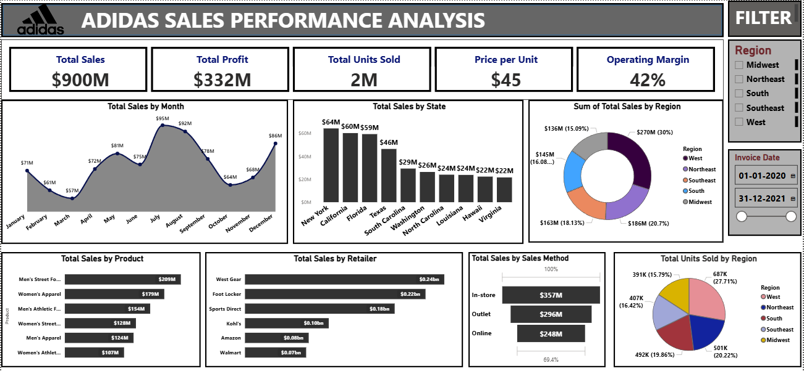

# Adidas Sales Performance Analysis | Power BI & Excel



## Project Overview
This project analyzes Adidas sales performance using Power BI to provide actionable insights for business decision-making. The dashboard consolidates key metrics such as total sales, profit, units sold, and operating margins, while also highlighting trends across products, regions, and sales channels.

## Business Problem
- Adidas operates across multiple regions, product categories, and sales channels. Leadership needs clear visibility into what is driving revenue, where profitability is strongest, and where performance is underperforming.
- However, raw sales data alone does not directly answer critical business questions such as:
- Which regions are contributing most to revenue and which require strategic attention?
- Which product categories and products are driving profitability?
- Which sales channels (in-store, online, outlet) are performing best?
- How does performance change across time and seasons?
- Which retailers contribute most to overall business success?

### Core Business Problem:
- How can Adidas use historical sales data to identify revenue drivers, improve profitability, optimize channel strategy, and prioritize high-impact markets and products?
- This project solves that problem by transforming raw transactional data into a structured dashboard that provides:
- Performance tracking across KPIs (Sales, Profit, Units, Margin)
- Regional and market-level visibility
- Product and category-level profitability analysis
- Channel effectiveness insights
- Seasonal performance trends to support planning decisions

## Executive Summary (Short)
- **Total Sales:** $900M, **Profit:** $332M, **Units Sold:** 2M  
- **West region** contributes ~30% of sales, Midwest shows growth potential  
- **Men’s Street Footwear & Women’s Apparel** are top product categories  
- **In-store sales** dominate; online presents growth opportunity  
- Seasonal trends indicate **peak sales mid-year and year-end**

## Business Recommendations
- Prioritize the West region, as it generates the highest revenue, by focusing marketing and premium product launches.
- Improve performance in weaker regions (like Midwest) using targeted campaigns and better regional assortment.
- Invest more in top categories such as Men’s Street Footwear and Women’s Apparel to maximize returns.
- Grow online sales, as in-store dominates and digital still has strong untapped potential.
- Plan campaigns around peak seasons (mid-year and year-end) to boost revenue impact.

## Tools Used
- **Power BI:** Dashboard creation, KPIs, interactive slicers, visualization design  
- **AI Tools:** For documentation, summary writing, and presentation support

## Project Structure
```
├── assets/
│   ├── Adidas_Dashboard_Image.png
│   └── Adidas_logo.png
├── dashboard/
│   └──adidas_dashboard.pbix
├── data/
│   └── Adidas_US_Sales_Datasets.csv
├── presentation/
│   └── Adidas-Sales-Performance-Analysis-slides.pptx
├── project_recording/
│   └──Addidas_Project_Recording.mp4
├── summary_report/
│   └── project_report.pdf
├── README.md
```

## Full Executive Summary 📄
[Download Full Executive Summary](summary_report/Detailed_Executive_Summary.docx)  


## Project Files 📊
- [Power BI Dashboard File (.pbix)](dashboard/adidas_dashboard.pbix)  
- [adidas_raw_data(.xlsx)](data/Adidas_US_Sales_Datasets.xlsx)  


## Video Walkthrough 🎥
[Watch Dashboard Interaction (30 sec)](project_recording/Addidas_Project_Recording.mp4)  
*Short interactive demo showing filters, slicers, and KPIs*
